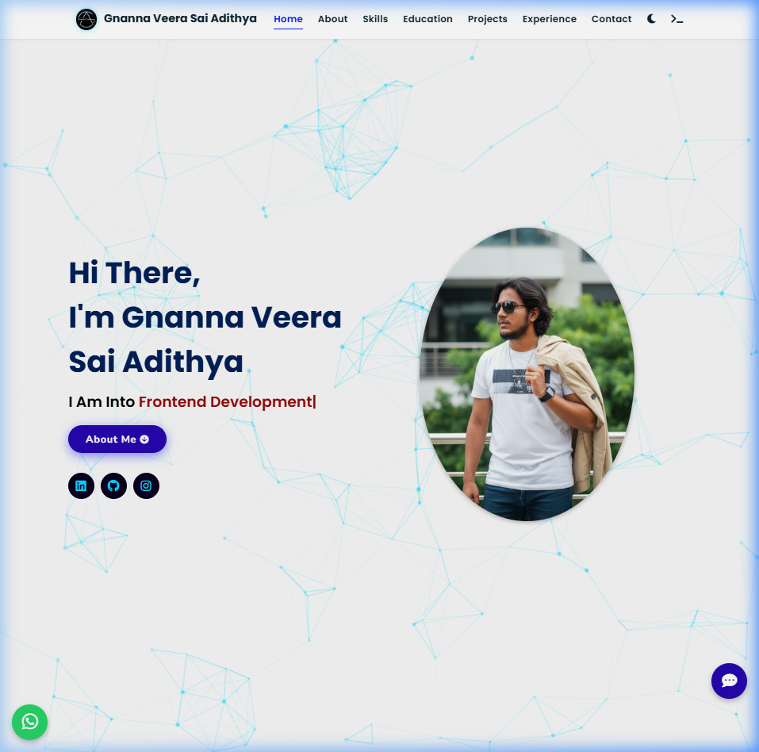

# 🚀 Advanced AI-Integrated Portfolio

A state-of-the-art, interactive portfolio website featuring an AI Chatbot, Matrix-style preloader, and a custom terminal interface. Built for performance, aesthetics, and high user engagement.



## 🌟 Key Features

### 🧠 AI & Intelligence
- **Llama 3.1 AI Chatbot:** Integrated floating assistant powered by Groq (Llama-3.1-8b-instant).
- **Interactive Terminal:** A fully functional CLI mode where users can type `ask [question]` to interact with the AI.

### 🎨 Visual Experience
- **Matrix Preloader:** A movie-inspired falling code animation that runs during site initialization.
- **Neon UI/UX:** Sleek dark mode with neon accents, custom glowing scrollbars, and scroll progress tracking.
- **Dynamic Logo:** 360° spin animation with a cyan glow on hover.
- **3D Tilt Effects:** Smooth parallax interactions on project cards using VanillaTilt.js.

### 🛠️ Functionality
- **Live Visitor Counter:** Anonymous real-time tracking of profile visits.
- **WhatsApp Integration:** Floating quick-contact button.
- **Responsive Design:** Optimized for all screen sizes from mobile to desktop.
- **Developer Mode Protection:** Built-in security to prevent unauthorized code inspection (Right-click & F12 disabled).

## 🚀 Tech Stack
- **Frontend:** HTML5, CSS3, JavaScript (ES6+)
- **AI Backend:** Groq Cloud API (Llama 3.1)
- **Libraries:**
  - Particles.js (Dynamic backgrounds)
  - Typed.js (Typing animations)
  - VanillaTilt.js (3D effects)
  - ScrollReveal (Scroll animations)
  - FontAwesome (Icons)

## 📦 Installation & Deployment

1. **Clone the repo:**
   ```bash
   git clone https://github.com/vgvvlsa3145/vgvvlsa.dev.git
   ```
2. **Setup API Key:**
   Open `assets/js/script.js` and replace the placeholder with your Groq API Key.
3. **Run Locally:**
   Simply open `index.html` in your browser or use a local server like `live-server`.

## 🛡️ Security Note
The Groq API key is currently used on the client-side for demonstration. For production use, it is recommended to move the API call to a **Serverless Function (Vercel/Netlify)** to keep the key hidden from the frontend.

---
Designed with ❤️ by [Gnanna Veera Sai Adithya](https://linkedin.com/in/vgvvlsa2004)
